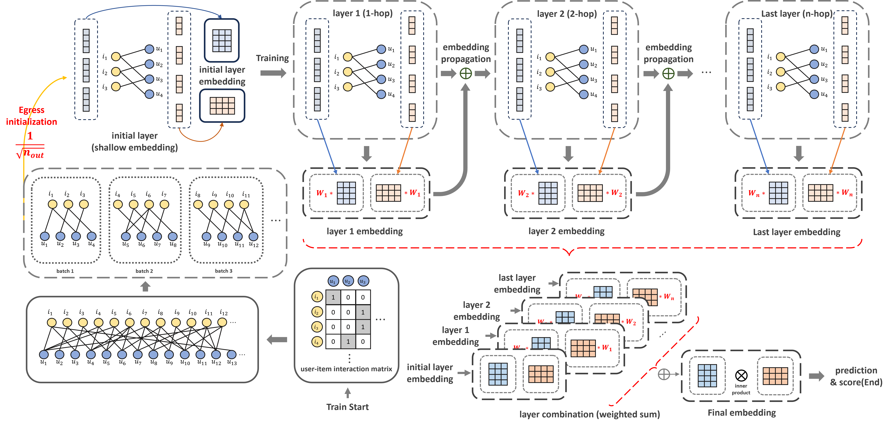

This repository was created utilizing the [survey report](https://arxiv.org/abs/2203.15876) on self-supervised learning for recommender systems. <br>
The existing library was taken, modified, and experimented with, and this repository is called [SELFRec](https://github.com/Coder-Yu/SELFRec). <br>

---

## Requirements

```shell
  numba==0.53.1
  numpy==1.20.3
  scipy==1.6.2
  tensorflow==1.14.0
  torch>=1.7.0
```

---

## Deployment

1. Docker Hub: <https://hub.docker.com/repository/docker/dodo9249/thingcn>
2. Wandb: <https://wandb.ai/d9249/OptGCN>

---

## Proposal Learning Structure Diagram



## Usage

1. conf, which contains the detailed parameters of the models utilized in this study. (You can adjust the weight of Weighted Forwarding.)
2. When you run run.sh, all the models in this study are executed.

---
## Implemented Models
  
| Model | Paper| Type| Code|
|:------|:------|:------:|:------:|
|LightGCN|He et al. [LightGCN: Simplifying and Powering Graph Convolution Network for Recommendation](https://dl.acm.org/doi/10.1145/3397271.3401063), SIGIR'20.|Graph|PyTorch|
|NCL|Lin et al. [Improving Graph Collaborative Filtering with Neighborhood-enriched Contrastive Learning](https://arxiv.org/abs/2202.06200), WWW'22.|Graph + CL|PyTorch|
|SGL|Wu et al. [Self-supervised Graph Learning for Recommendation](https://dl.acm.org/doi/10.1145/3404835.3462862), SIGIR'21.|Graph + CL|TensorFlow & Torch|
|MixGCF|Huang et al. [MixGCF: An Improved Training Method for Graph Neural Network-based Recommender Systems](https://keg.cs.tsinghua.edu.cn/jietang/publications/KDD21-Huang-et-al-MixGCF.pdf), KDD'21.|Graph + DA|PyTorch|
|SimGCL|Yu et al. [Are Graph Augmentations Necessary? Simple Graph Contrastive Learning for Recommendation](https://arxiv.org/abs/2112.08679), SIGIR'22.|Graph + CL|PyTorch|
|XSimGCL|Yu et al. [XSimGCL: Towards Extremely Simple Graph Contrastive Learning for Recommendation](https://arxiv.org/abs/2209.02544), TKDE'23.| Graph + CL| PyTorch|
|BUIR|Lee et al. [Bootstrapping User and Item Representations for One-Class Collaborative Filtering](https://arxiv.org/abs/2105.06323), SIGIR'21.|Graph + DA|PyTorch|

* CL is short for contrastive learning (including data augmentation); DA is short for data augmentation only

---

## Leaderboard

General hyperparameter settings are: epoch: 300, batch_size: 2048, emb_size: 64, learning rate: 0.001, L2 reg: 0.0001. <br>

|  Model   | Hyperparameter settings                                                                        |
|:--------:|:-----------------------------------------------------------------------------------------------|
| LightGCN | layer=3                                                                                        |
| NCL      | layer=3, ssl_reg=1e-6, proto_reg=1e-7, tau=0.05, hyper_layers=1, alpha=1.5, num_clusters=2000  |
| SGL      | layer=3, λ=0.1, ρ=0.1, tau=0.2                                                                 |
| MixGCF   | layer=3, n_nes=64                                                                              |
| SimGCL   | layer=3, λ=0.5, eps=0.1, tau=0.2                                                               |
| XSimGCL  | layer=3, λ=0.2, eps=0.2, l∗=1, tau=0.15                                                        |
| BUIR     | layer=3, tau=0.995, drop_rate=0.2                                                              |

The results are obtained on the dataset of 

> 
> <b>[Yelp2018](/results/markdown/yelp2018.md)</b><br> <b>[douban-book](/results/markdown/douban-book.md)</b><br> <b>[Amazon-Book](/results/markdown/Amazon-Book.md)</b><br> <b>[Amazon-kindle](/results/markdown/Amazon-kindle.md)</b><br> <b>[FilmTrust](/results/markdown/FilmTrust.md)</b><br> <b>[MovieLens-1m](/results/markdown/MovieLens-1m.md)</b><br> <b>[iFashion](/results/markdown/iFashion.md)</b><br> <b>[gowalla](/results/markdown/gowalla.md)</b><br>
> 

---

## Related Datasets

<div>
  <table class="table table-hover table-bordered">
    <tr>
      <th rowspan="2" scope="col">DataSet</th>
      <th colspan="5" scope="col" class="text-center">Basic Meta</th>
      <th colspan="3" scope="col" class="text-center">User Context</th>
    </tr>
    <tr>
      <th class="text-center">Users</th>
      <th class="text-center">Items</th>
     <th colspan="2" class="text-center">Ratings (Scale)</th>
      <th class="text-center">Density</th>
      <th class="text-center">Users</th>
      <th colspan="2" class="text-center">Links (Type)</th>
    </tr>
    <tr>
      <td><a href="https://pan.baidu.com/s/1hrJP6rq" target="_blank"><b>Douban</b></a> </td>
      <td>2,848</td>
      <td>39,586</td>
      <td width="6%">894,887</td>
      <td width="10%">[1, 5]</td>
      <td>0.794%</td>
      <td width="4%">2,848</td>
      <td width="5%">35,770</td>
      <td>Trust</td>
    </tr>
    <tr>
      <td><a href="https://www.dropbox.com/sh/h97ymblxt80txq5/AABfSLXcTu0Beib4r8P5I5sNa?dl=0" target="_blank"><b>Yelp2018</b></a> </td>
      <td>19,539</td>
      <td>21,266</td>
      <td width="6%">450,884</td>
      <td width="10%">implicit</td>
      <td>0.11%</td>
      <td width="4%">19,539</td>
      <td width="5%">864,157</td>
      <td>Trust</td>
    </tr>
    <tr>
      <td><a href="https://www.dropbox.com/sh/20l0xdjuw0b3lo8/AABBZbRg9hHiN42EHqBSvLpta?dl=0" target="_blank"><b>Amazon-Book</b></a> </td>
      <td>52,463</td>
      <td>91,599</td>
      <td width="6%">2,984,108</td>
      <td width="10%">implicit</td>
      <td>0.11%</td>
      <td width="4%">-</td>
      <td width="5%">-</td>
      <td>-</td>
    </tr>
    <tr>
      <td><a href="" target="_blank"><b>Amazin-Kindle</b></a> </td>
      <td>0</td>
      <td>0</td>
      <td width="6%">0</td>
      <td width="10%">a</td>
      <td>0%</td>
      <td width="4%">-</td>
      <td width="5%">-</td>
      <td>-</td>
    </tr>
    <tr>
      <td><a href="" target="_blank"><b>FilmTrust</b></a> </td>
      <td>0</td>
      <td>0</td>
      <td width="6%">0</td>
      <td width="10%">a</td>
      <td>0%</td>
      <td width="4%">-</td>
      <td width="5%">-</td>
      <td>-</td>
    </tr>  
    <tr>
      <td><a href="" target="_blank"><b>iFashion</b></a> </td>
      <td>0</td>
      <td>0</td>
      <td width="6%">0</td>
      <td width="10%">a</td>
      <td>0%</td>
      <td width="4%">-</td>
      <td width="5%">-</td>
      <td>-</td>
    </tr>
    <tr>
      <td>
        <a href="" target="_blank">
          <b>MovieLens-1m</b>
        </a>
      </td>
      <td>0</td>
      <td>0</td>
      <td width="6%">0</td>
      <td width="10%">a</td>
      <td>0%</td>
      <td width="4%">-</td>
      <td width="5%">-</td>
      <td>-</td>
    </tr>
    <tr>
      <td>
        <a href="http://files.grouplens.org/datasets/hetrec2011/hetrec2011-lastfm-2k.zip" target="blank">
          <b>LastFM</b>
        </a>
      </td>
      <td>1,892</td>
      <td>17,632</td>
      <td width="6%">92,834</td>
      <td width="10%">implicit</td>
      <td>0.27%</td>
      <td width="4%">1,892</td>
      <td width="5%">25,434</td>
      <td>Trust</td>
    </tr>
  </table>
</div>

---

<h2>Reference</h2>

**SELFRec** is a Python framework for self-supervised recommendation (SSR) which integrates commonly used datasets and metrics, and implements many state-of-the-art SSR models. SELFRec has a lightweight architecture and provides user-friendly interfaces. It can facilitate model implementation and evaluation.
<br>
**Founder and principal contributor**: [@Coder-Yu](https://github.com/Coder-Yu) [@xiaxin1998](https://github.com/xiaxin1998) <br>
**Supported by**: [@AIhongzhi](https://github.com/AIhongzhi) (<a href="https://sites.google.com/view/hongzhi-yin/home">A/Prof. Hongzhi Yin</a>, UQ)

This repo is released with our [survey paper](https://arxiv.org/abs/2203.15876) on self-supervised learning for recommender systems. We organized a tutorial on self-supervised recommendation at WWW'22. Visit the [tutorial page](https://ssl-recsys.github.io/) for more information.

<p>
   If you find this repo helpful to your research, please cite our paper.
</p>

```text
@article{,
  title={Optimization methods for Graph Convolution Networks in Recommendation Systems},
  author={Sangmin Lee, Namgi Kim},
  journal={},
  year={2023}
}
```

```text
@article{yu2022self,
  title={Self-Supervised Learning for Recommender Systems: A Survey},
  author={Yu, Junliang and Yin, Hongzhi and Xia, Xin and Chen, Tong and Li, Jundong and Huang, Zi},
  journal={arXiv preprint arXiv:2203.15876},
  year={2022}
}
```
